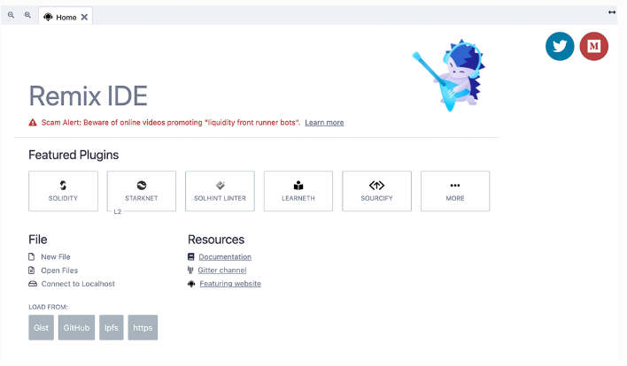
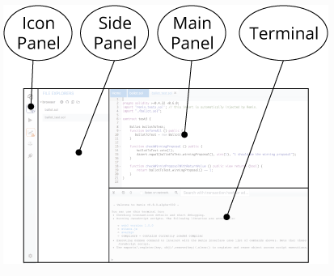
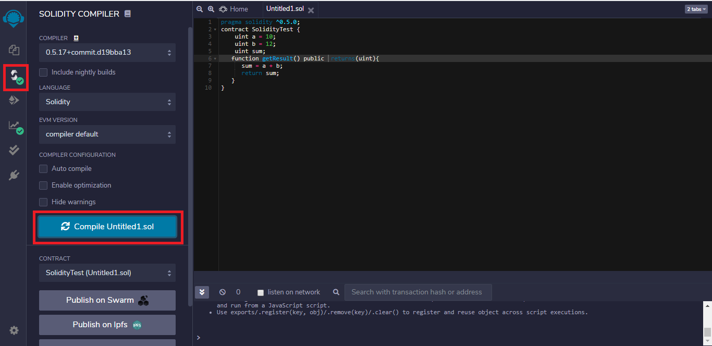

# 02 – Intro to Remix IDE

> 📘 **Objective**: 
> - Get familiar with the Remix development environment, create and compile your first smart contract, and learn how to handle common errors.
> - Understand Remix’s workspace structure, panels, plugins, and how to compile and deploy a smart contract from start to finish.

---

## 1. What Is Remix?



Remix is a browser-based Integrated Development Environment (IDE) for Solidity. It allows you to:

- Write smart contract code
- Compile to check for syntax errors
- Deploy contracts to a virtual test chain (no real ETH needed)
- Interact with contracts and test functions

🟢 Advantages of Remix:

- ✅ No installation needed — just use a browser
- ✅ Built-in virtual blockchain for easy practice
- ✅ Many tools included (debugger, autocomplete, etc.)

🔗 Access Remix at: [https://remix.ethereum.org](https://remix.ethereum.org)


---

## 2. Remix Interface Overview

### 🧭 Understanding the Remix Interface



Remix IDE is divided into four core panels:

| Panel        | Description                                   |
|--------------|-----------------------------------------------|
| 📚 Icons Panel | Left vertical bar – switch between plugin panels |
| 📄 Side Panel  | Shows the selected plugin's tools and options |
| 🖊 Main Panel  | Central area for editing `.sol` code          |
| 🖥 Terminal     | Bottom log area – shows compiler logs, deploy logs, transactions, etc. |


---

### 🧭 Icon Panel at Page Load


| Area            | Description                            |
|------------------|----------------------------------------|
| File Explorer     | Create and browse `.sol` files         |
| Solidity Compiler | Set compiler version, compile code     |
| Deploy & Run      | Deploy contracts to virtual blockchain |
| Plugin Manager    | Enable tools like debugger, exporter   |
| Settings          | Theme, font, auto-save preferences     |


---

## 3. Recommended Initial Setup

### ✅ Enable Core Plugins:

1. Click the plugin icon (🧪 Plugin Manager) in the lower-left corner
2. Enable the following:
   - ✅ Solidity Compiler (for compiling Solidity code)
   - ✅ Deploy & Run Transactions (for deploying and interacting with contracts)

🔍 You can also enable more tools like Debugger, Flattener, and Solidity Static Analysis.

### ✅ Suggested Settings:

1. Click the ⚙️ Settings icon
2. Recommended options:
   - [x] Auto save
   - [x] Enable optimization
3. Theme: Choose Light or Dark based on preference

## 🏠 2. Opening the Home Tab

- When you first open Remix, a **Home** tab will appear.
- If closed, click the Remix logo or Home icon to reopen it.
- The Home tab includes:
  - Links to official docs and learning resources
  - Access to starter templates (e.g. Storage, NFT, ERC20)
  - Plugin manager shortcuts


## 🔌 3. Exploring the Plugin Manager

Click 🧪 **Plugin Manager** icon (bottom-left) to manage active plugins.

### ✅ Must-Have Plugins:
- `Solidity Compiler`
- `Deploy & Run Transactions`

### 🛠 Optional (Recommended) Plugins:
- `Debugger` – for testing transactions step-by-step
- `Solidity Static Analysis` – for code suggestions and warnings
- `File Explorer` – enhanced file structure browsing


---

## 🗂 4. Understanding Workspaces

Remix uses the **Workspace** concept to organize projects.

### 📁 What is a Workspace?
A workspace contains:
- Your project’s folder structure (`contracts/`, `scripts/`, `tests/`)
- Files you've written or imported
- Compiler and deployment history

### ➕ Create a New Workspace:
1. Click the 📁 File Explorer
2. Click the **☰ (hamburger menu)** on the top of the file browser
3. Select **+ Create**  
4. Choose:
   - `Blank` (empty)
   - Prebuilt templates (e.g. ERC20, NFT, Storage)
   - Import from GitHub via URL


---

## 📂 5. Managing Solidity Files

### Open Files:
- Expand the `contracts/` folder
- Click any `.sol` file to open it in the editor (e.g. `2_Owner.sol`)

### Edit & Save:
- Enable **Auto Save** in ⚙️ Settings for convenience
- Or press `Ctrl + S` / `Cmd + S` to save manually

---


## 4. Create Your First Contract File: `SimpleStorage.sol`

📄 Steps:

1. Click the 📁 File Explorer icon on the left
2. Expand the `contracts` folder (or create one if missing)
3. Right-click → New File → Name it `SimpleStorage.sol`
4. In the editor, enter the following Solidity code:

```solidity
// SPDX-License-Identifier: MIT
pragma solidity ^0.8.8;

contract SimpleStorage {
    uint256 favoriteNumber;

    function store(uint256 _favoriteNumber) public {
        favoriteNumber = _favoriteNumber;
    }

    function retrieve() public view returns (uint256) {
        return favoriteNumber;
    }
}
```


### 📘 Code Explanation

- `favoriteNumber`: A state variable stored on the blockchain.
- `store()`: A write function — modifies state, requires gas.
- `retrieve()`: A read-only function — does not modify state, free to call.


---

## 🧪 Compile the Contract

### Step-by-Step:

1. Click 💫 **Solidity Compiler** in the left menu.
2. Select **compiler version**: `0.8.8` (must match the `pragma` in your code).
3. Enable the following options:
   - ✅ **Auto Compile**
   - ✅ **Enable Optimization**
4. Click the button: **Compile SimpleStorage.sol**




---

### ✅ Successful Compilation

- A green ✅ checkmark appears beside the filename.
- No error or warning messages in the console.

---

## ❌ Common Compilation Errors & Fixes

| Error Message                            | Cause                                                        | Solution                                     |
|-----------------------------------------|--------------------------------------------------------------|----------------------------------------------|
| `Expected semicolon`                    | Missing `;` at the end of a line                             | Add `;` to the end of that line              |
| `Data location must be memory or calldata` | Using string/array/struct without specifying data location  | Add `memory` or `calldata` keyword           |
| `SPDX license identifier not provided`  | Missing license header at the top of the file                | Add `// SPDX-License-Identifier: MIT`        |
| `Compiler version mismatch`             | `pragma` version doesn’t match selected compiler             | Adjust pragma or select the correct compiler |

---

📘 **Tips:**

- Errors are shown with red marks in the code editor.
- Click the error or red icon to jump to the error line.
- Hover over the red underline to see detailed error descriptions.


## ✅ Mini Quiz

**Q1. What type of tool is Remix IDE?**  
A) A code linter  
B) A crypto wallet  
✅ C) A browser-based Solidity IDE  
D) A frontend design tool  

---

**Q2. How can you make a string parameter editable in a function?**  
A) Use `calldata`  
✅ B) Use `memory`  
C) No keyword needed  
D) Use `view`  

---

**Q3. If your code says `pragma solidity ^0.8.8;`, which compiler should you choose?**  
✅ A) 0.8.8 or higher (e.g. 0.8.10)  
B) 0.7.6  
C) Any version  
D) Exactly 0.9.0  


**Q4. What is the main purpose of a Workspace in Remix?**  
A) Wallet integration  
✅ B) Managing contract file structures  
C) Writing frontend code  
D) Storing private keys  

---

**Q5. Which function color in Remix indicates a read-only function?**  
✅ A) Blue  
B) Orange  
C) Red  
D) Green  

---

**Q6. What is Remix’s JavaScript VM?**  
A) An ETH wallet  
✅ B) A browser-based blockchain simulator  
C) A cloud-based compiler  
D) An Ethereum testnet  


