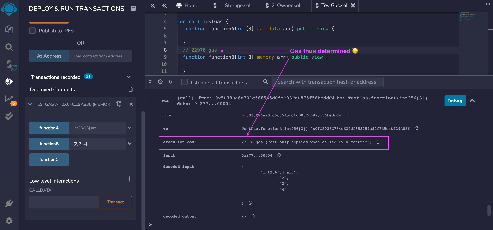

# 04 – Gas and Transaction Basics in Solidity

> 📘 **Goal:** Understand how gas works in Solidity, how transactions cost gas, and how to optimize your code to be more efficient.

---

## ⚡ What Is Gas in Ethereum?

Gas is the unit that measures the computational work required to execute operations on the Ethereum Virtual Machine (EVM).

- Every **operation** (storage write, loop, function call, etc.) costs gas
- Users must **pay gas fees** in ETH to execute transactions

### Why Gas Exists:
- Prevents spam and denial-of-service attacks
- Encourages efficient smart contract code
- Rewards miners/validators for executing transactions

---

## 🚗 What Is a Transaction?

A **transaction** is a message sent from one account to another that can:
- Transfer ETH
- Deploy a contract
- Call a function that modifies state

### When do you pay gas?

| Action                     | Gas Needed? | Explanation                                 |
|---------------------------|-------------|---------------------------------------------|
| Reading a view/pure func  | No          | No state change, no gas required            |
| Writing to storage        | Yes         | Modifies blockchain state                   |
| Deploying a contract      | Yes         | Initializes contract on-chain               |
| Sending ETH               | Yes         | Transfer includes a transaction             |

---

## 📊 Gas Estimation and Limits

### Gas Limit
Maximum gas you're willing to consume for a transaction.

### Gas Used
Actual amount consumed to process the transaction.

### Gas Price
Amount of ETH (in gwei) you're willing to pay per unit of gas.

```solidity
// Writing to storage costs gas
function store(uint256 _number) public {
    favoriteNumber = _number;
}
// Reading state is free (no gas if called externally)
function retrieve() public view returns (uint256) {
    return favoriteNumber;
}

```
### 🔍 Explanation of `retrieve()` function:

- `public`: Can be called from inside or outside the contract.
- `view`: The function promises not to modify the blockchain state.
- `returns (uint256)`: It returns an unsigned integer.

💡 **Why it doesn't cost gas when called externally**:  
If the function is called externally (e.g., from Remix or a frontend dApp), it doesn’t send a transaction and thus doesn’t require gas. However, if it's called from within another function in a transaction, it will contribute to the total gas cost of that transaction.

---

### 📊 How to Check Gas Cost in Remix

To view the gas cost of a transaction in Remix:

1. Open the **Deploy & Run Transactions** plugin (🪧 icon).
2. Deploy your contract to the **JavaScript VM**.
3. Click any function (e.g. `store`, `retrieve`).
4. Scroll down to the **Remix terminal output** panel.
5. Look for the **`transact to`** or **`call to`** log:
   - `execution cost`: actual gas used
   - `transaction cost`: gas used including overhead



💡 **Tip**: Use the **Gas Profiler** plugin in Remix for detailed per-line breakdowns.

---

### 💸 How to Reduce Gas Costs

| Technique                        | Description                                              |
|----------------------------------|----------------------------------------------------------|
| Use `uint256` over smaller uints | Prevents padding/packing overhead                        |
| Avoid unnecessary storage writes | Writing to storage is expensive                          |
| Use `view` and `pure` modifiers  | Signals no state changes; avoids unnecessary gas costs   |
| Pack variables (advanced)        | Pack multiple small variables into a single 256-bit slot |
| Use `constant` and `immutable`   | Saves gas by avoiding runtime storage                    |

---

### 🎯 Practical Example: Gas Comparison

Try the following two contracts and compare their gas usage in Remix.

```solidity
// Expensive
function increment() public {
    counter = counter + 1;
}

// Cheaper
function addOne(uint256 _base) public pure returns (uint256) {
    return _base + 1;
}
```
Deploy and test both in Remix. Use the **Deploy & Run** tab to view execution cost.

---

### 🎓 Best Practices

- ✅ Minimize writes to blockchain storage
- ✅ Use `view` or `pure` when functions don't modify state
- ✅ Test gas cost with Remix's **Deploy & Run** gas info panel
- ✅ Use `uint256` for optimal gas cost across EVM
- ✅ Avoid loops when possible (especially unbounded ones)

---

### 💡 Mini Exercise

Create a contract with two functions:

- `writeNumber(uint256)` that sets a state variable
- `getDouble(uint256)` that returns `2 * input` as `pure`

Deploy and test gas usage in Remix for each function.

---

### ✅ Quiz

**Q1. Which function type requires gas to call?**  
A) pure  
B) view  
✅ C) A function that writes to state  
D) internal

**Q2. What does "gas used" represent?**  
A) Max gas allowed  
B) Gas left over  
✅ C) Actual gas spent during execution  
D) ETH paid in fees

**Q3. Which keyword saves gas by preventing unnecessary storage?**  
A) storage  
B) payable  
✅ C) constant  
D) fallback

---

### 📓 Further Reading

- [Ethereum Yellow Paper](https://ethereum.github.io/yellowpaper/paper.pdf)
- [Solidity Gas Costs](https://docs.soliditylang.org/en/latest/internals/gas.html)
- [Remix Gas Profiler Plugin](https://remix-ide.readthedocs.io/en/latest/remix-gas-profiler.html)

---


